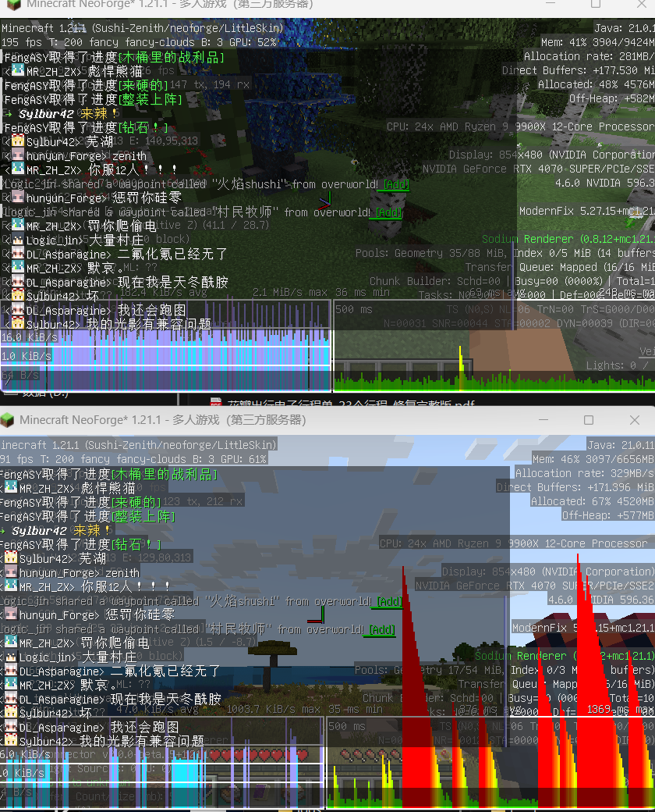

# Raknetify — 中国大陆网络适配分支

**简体中文** | [English](README.en.md)

本项目是 [RelativityMC/raknetify](https://github.com/RelativityMC/raknetify) 的非官方分支。感谢上游作者及贡献者提供的 RakNet 多通道传输基础。**使用本分支遇到问题，请提交到[本仓库 Issues](https://github.com/ERroooooR/raknetify/issues)，不要直接向原项目提交本分支的问题。**

> **实验性与 AIGC 声明：** 本仓库的分支提交包含大量 AIGC（人工智能生成内容）及 AI 辅助编写的代码、文档。无法保证最新构建的稳定性；构建成功或存在自动化测试不代表实际联机环境稳定。

## 项目目标与支持范围

上游面向不可靠、受限网络下的 Minecraft 联机体验；本分支的目标与上游不同，主要针对**中国大陆地区的 QoS、限包速、丢包、抖动与突发流量情况**修改和调优。无法确保这些策略具有普适性，也不保证在其他地区、运营商或线路上改善性能。

**本分支支持 NeoForge 环境下的信雅互联（Sinytra Connector），Velocity（VC）代理环境也可用。** 这里指通过 Connector 加载 Fabric 版 Raknetify，并非提供原生 NeoForge 模组。这一兼容范围不等于承诺所有 Minecraft / NeoForge / Connector 版本、整合包或最新构建都稳定可用。

其他平台（如原生 Fabric、BungeeCord）预计也可用，但尚未经测试，不作兼容性保证。ViaVersion 等组合也需要单独验证。

## 已完成的改进

以下内容依据当前代码及仓库固定的 `netty-raknet` 子模块整理，描述已实现的机制，不代表已证明在所有网络中有效：

- **NeoForge / Connector 适配：** 增加 Connector 专用服务端绑定与通道初始化处理，调整加密相关注入，并修正与 Fabric Networking API 的部分 Mixin 交互。
- **自适应传输：** 默认启用包速率与字节节奏控制、滚动丢包分类、拥塞窗口控制及有界突发排空；保留空闲前已验证的路径容量，减少恢复发送时不必要的速率回落。
- **协议与 MTU：** 默认优先 RakNet v12，在旧端拒绝初始请求时回退 v11；通过协商使用路径 MTU 探测（DPLPMTUD）及有界 Reed–Solomon FEC，并提供 MTU 回退。旧协议不会发送 v12 扩展包。
- **丢包与有序队列恢复：** 实现短乱序 NACK 宽限、按需 ACK/NACK 重复保护、RACK 风格丢包推断、PTO 探测、应用流量受限时的额外恢复，以及针对有序队列阻塞的定向修复和对端反馈。额外恢复受发送预算及拥塞条件约束。
- **压缩兼容：** 增加 BandwidthOptimizer 与 ZSTD_Compresser 的检测和管线适配，处理重复压缩、压缩协商及 Velocity 侧冗余长度前缀；详见下方限制。
- **可观测性：** 增加双向传输指标、分通道队头阻塞诊断、压缩批次指标及异步 JSONL 导出，便于区分丢包、排队与压缩批次造成的延迟。
- **连接处理：** 增加 Gate 路由提示，修正 IPv6 地址处理及部分握手、关闭和分片同步行为。

实现入口：[传输配置](common/src/main/java/com/ishland/raknetify/common/connection/RakNetConnectionUtil.java)、[Fabric 适配](fabric/src/main/java/com/ishland/raknetify/fabric/mixin)、[传输子模块](netty-raknet)、[恢复设计与开关](docs/ADAPTIVE_RECOVERY_ROADMAP.md)。设计文档包含演进方向，不能将所有设想视为已完成的性能验证。

## 优化前后对比



**上方：优化后；下方：优化前。** 这是实际使用场景的截图对比，用于展示该场景下的表现变化，不代表所有地区和线路都能获得相同效果。

## 网络优化如何工作

以下说明对应本分支固定的传输子模块提交 `e7f8627`。这些是代码中的控制策略与阈值，不是对中国大陆所有线路的实测结论，也不是延迟或吞吐保证。这里的 PPS 指传输数据报发送节奏；增加 PPS 上限不等于增加可用带宽。

### 1. 根据反馈调速，而不是把所有丢包都当作拥塞

控制器以 10 个一秒桶统计 ACK 与丢失事件，并结合平滑 RTT、最小 RTT、连续丢失及报文大小分类。`QUEUE` 表示 RTT 膨胀并伴随丢包等排队信号；至少 64 个样本、丢失比例达到 3% 且 RTT 未明显膨胀时，可判为 `RATE_LIMIT`；连续至少 3 次丢失可判为 `BURST`；其他孤立丢失归为 `RANDOM`。这些条件有判定优先级，**分类是启发式推断，无法证明运营商实施了某种 QoS 策略**。

发生一次新的调速响应时，`RATE_LIMIT` 将包速率乘以 0.70，`QUEUE` / `BURST` 乘以 0.75，其余丢失分支乘以 0.85，再应用上下限及突发控制。同一拥塞事件中的重复反馈不会反复执行整套乘法降速，以免把速率压到下限。恢复由 ACK 进展驱动，不能把长时间没有反馈当作带宽恢复证据。

源码：[AdaptiveTransportController.onLoss / applyLossPacingCeiling](https://github.com/RelativityMC/netty-raknet/blob/e7f8627521798289db32a9ded8e5bfc89c74334b/common/src/main/java/network/ycc/raknet/pipeline/AdaptiveTransportController.java)。

### 2. 同时控制包速率、在途数据和大批次启动

发送前先检查拥塞窗口（已发送但未确认的字节数），再检查包令牌；正常情况下令牌桶最多积累 4 个数据报，`BURST` / `QUEUE` / `RATE_LIMIT` 时收紧到 1 个。窗口根据交付速率、最小 RTT 和 ACK 聚集量调整，包含 `STARTUP`、`DRAIN`、`PROBE_BW`、`PROBE_RTT` 状态。这是本项目的模型化实现，不应等同于完整标准 BBR。

区块同步或压缩合批会形成大队列。代码以“排队 + 在途字节”判断是否进入 `BULK`：进入阈值随拥塞窗口变化且不超过 48 KiB，退出阈值不超过 16 KiB。当前排空目标为 **2 秒**；超过目标后不能仅因队列变老就无限加速，而会参考已验证容量。RTT 压力或仍活跃的严重丢包信号会限制突发提速。

受字节准入约束的路径还使用字节令牌平滑启动；初始准入速率通常受 384 KiB/s 和当前包速率估算共同约束，已有容量记录时可调整。**并非所有 BULK 流量始终经过这层字节门控**：最初一分钟的校准窗口或满足健康探测条件时可走 `WORK_CONSERVING` 路径，跳过该门控，但包节奏与拥塞窗口检查仍存在。`2000 PPS` 是默认配置上限，不是恒定发送速率。

源码：[sendBudget / updateBurstDrain / workConservingBulk](https://github.com/RelativityMC/netty-raknet/blob/e7f8627521798289db32a9ded8e5bfc89c74334b/common/src/main/java/network/ycc/raknet/pipeline/AdaptiveTransportController.java)。

### 3. 保留已验证容量，避免空闲后重新从低速起步

交付速率估算限制 ACK 聚集造成的虚高样本；应用没有足够数据发送时产生的低速样本不会直接压低保留的最大带宽。健康路径上，5 分钟内的已验证容量可用于恢复发送；较旧的记录先以一半速率尝试，并通过两轮字节 ACK 验证。验证期间出现丢失会转入 `SAFE_RETREAT`。这是当前连接内的历史状态，不是跨连接保存的测速结果。

源码：[updateDeliveryRate / startBurstAdmission / updateResumeValidation](https://github.com/RelativityMC/netty-raknet/blob/e7f8627521798289db32a9ded8e5bfc89c74334b/common/src/main/java/network/ycc/raknet/pipeline/AdaptiveTransportController.java)。

### 4. 区分短乱序、反馈丢失与真正需要重传的数据

- **NACK 宽限：** 仅缺少 1–2 个 FrameSet 时等待 RTT / 抖动相关的 4–25 ms；更大的缺口直接恢复。最近 8–32 次结果中至少 88% 为宽限到期而非乱序到达时，暂时绕过等待，至少 2 秒后允许一次延迟探测。
- **ACK/NACK 保护：** 一秒内收到 3 个重复可靠 FrameSet 后，ACK 保护至少维持 2 秒；合并 ACK 范围并在 5–20 ms 后额外重复一次。ACK 保护或 NACK 宽限绕过活跃时，也可合并并重复 NACK；缺失报文已到达则取消对应待重复范围。健康流量不会永久双发 ACK。
- **RACK 风格推断：** 用更新发送的数据已被确认这一事实推断旧数据丢失。乱序时间窗基于 RTT，基础为 1.25 倍，出现误判迹象时可扩大至 2 倍，减少无谓重传。
- **PTO 探测：** 没有新 ACK 时，按 `RTT + max(1 ms, 4 × RTT 标准差) + retryDelay` 计算基础超时，再进行有上限的指数退避。优先探测可能解除有序阻塞的数据，仍受发送预算约束；探测超时本身不等于整批数据已经丢失。

源码：[ReliabilityHandler](https://github.com/RelativityMC/netty-raknet/blob/e7f8627521798289db32a9ded8e5bfc89c74334b/common/src/main/java/network/ycc/raknet/pipeline/ReliabilityHandler.java)。

### 5. 把修复预算用于阻塞的数据，限制冗余开销

**普通 FEC** 需要扩展协商，并仅在随机丢失比例为 0.5%–3%、没有 BULK 排空且没有 RTT 排队膨胀时考虑启用。接收端反馈至少 64 组、恢复收益低于每组 0.01 个恢复报文时，普通 FEC 暂停 10 秒，避免持续发送几乎无效的冗余。

**定向 FEC** 是另一条路径：从最多 8 个近期数据报中选 4 个组成滚动修复组，生成 1 个 Reed–Solomon 校验分片，优先考虑对端指出的阻塞目标。候选必须已有有序重传记录，且“重试次数 + 自发送以来经过的 RTT 数”达到 2；每 RTT 的校验字节预算不超过当前 MTU（代码下限为 256 字节），并检查拥塞窗口。它不等同于全局提高 FEC 比例，也不沿用普通 FEC 的随机丢失触发条件。

应用队列为空时，额外恢复可以为已重传、仍未确认的可靠数据提供一次补发机会；每个逻辑数据在同一应用受限阶段最多一次，并与 PTO 共享冷却。对端有序阻塞反馈还可触发精确探测：阻塞年龄至少为 `max(250 ms, 2 × RTT)`，同一目标间隔至少为 `max(500 ms, RTT)`，反馈保留 3 秒。

注意实现边界：额外恢复与定向 FEC 的公共许可条件在自适应开启时排除 BULK、RTT 膨胀、`QUEUE` 和 `MTU_BLACK_HOLE`，**并不单独排除 `RATE_LIMIT` 或 `BURST`**；仍需结合预算及实际指标评估开销。不能把设计意图描述为“任何限速场景都会禁用修复”。

源码：[LimitedFecHandler](https://github.com/RelativityMC/netty-raknet/blob/e7f8627521798289db32a9ded8e5bfc89c74334b/common/src/main/java/network/ycc/raknet/pipeline/LimitedFecHandler.java)、[ReliabilityHandler](https://github.com/RelativityMC/netty-raknet/blob/e7f8627521798289db32a9ded8e5bfc89c74334b/common/src/main/java/network/ycc/raknet/pipeline/ReliabilityHandler.java)、[allowsApplicationLimitedRecovery](https://github.com/RelativityMC/netty-raknet/blob/e7f8627521798289db32a9ded8e5bfc89c74334b/common/src/main/java/network/ycc/raknet/pipeline/AdaptiveTransportController.java)。

### 6. MTU、合包与 DSCP 各自解决不同问题

DPLPMTUD 对候选载荷发送探测并等待确认，以近似二分方式搜索，每个候选最多 3 次超时后收缩搜索范围；满足大包黑洞判定条件时退到基准载荷（不高于 1200 字节）。正常初始 MTU 为 1400，默认探测上限 1452；`raknetl;` 的较大初始 MTU 不会被这个默认上限强制压到 1452，因此不宜未经验证使用。MTU 探测依赖 v12 扩展协商，不能绕过 UDP 阻断。

小写入合并默认 500 微秒，在 `RATE_LIMIT` 时至少 1500 微秒，在 `QUEUE` / `BURST` 时至少 750 微秒，以少量等待换取更少报文。它与外部 ZSTD 的毫秒级压缩合批不同；后者仍可能隐藏包边界并导致单有序通道的队头阻塞。

静态 IP TOS 默认 `0xA0`（CS5）。自适应 DSCP 默认关闭；开启后聚合投票，至少 16 票、某侧严格超过另一侧两倍且满足 30 秒冷却时，尝试切换为 AF41 或 CS0。投票计数与切换状态在控制器类中静态共享，并非逐玩家独立标记；是否生效取决于 socket、操作系统和网络设备。

源码：[DplpmtudController](https://github.com/RelativityMC/netty-raknet/blob/e7f8627521798289db32a9ded8e5bfc89c74334b/common/src/main/java/network/ycc/raknet/pipeline/DplpmtudController.java)、[PathMtuDiscoveryHandler](https://github.com/RelativityMC/netty-raknet/blob/e7f8627521798289db32a9ded8e5bfc89c74334b/common/src/main/java/network/ycc/raknet/pipeline/PathMtuDiscoveryHandler.java)、[smallWriteCoalesceMicros / applyDscp](https://github.com/RelativityMC/netty-raknet/blob/e7f8627521798289db32a9ded8e5bfc89c74334b/common/src/main/java/network/ycc/raknet/pipeline/AdaptiveTransportController.java)。

## 安装与连接

1. 从**本仓库**的 [Releases](https://github.com/ERroooooR/raknetify/releases)（如有发布）或 [Actions 构建产物](https://github.com/ERroooooR/raknetify/actions/workflows/build.yml)获取对应版本。上游下载渠道不代表本分支构建。
2. 在 NeoForge 中通过信雅互联加载适配当前 Minecraft 版本的 Fabric 产物，并安装该 Connector 版本要求的依赖。不要仅凭上游的历史版本范围判断本分支兼容性。
3. 直连时客户端和服务端均需安装；使用代理时，RakNet 终止于安装了对应插件的代理，后端通常无需安装。Velocity（VC）环境可用，其他代理平台预计可用但未经测试。
4. 在服务端或代理放行与 Minecraft TCP 端口**相同端口号的 UDP 端口**，并确保 NAT / 转发链路支持 UDP。
5. 使用 `raknet;example.com` 连接。`raknetl;` 会请求高 MTU，不适合作为未经验证线路的默认选择。

## 兼容性与已知限制

| 场景 | 行为与限制 |
| --- | --- |
| NeoForge + 信雅互联 | 本分支支持的模组运行环境；仍需匹配游戏、加载器、Connector 和依赖版本。 |
| Velocity（VC） | 可用；需使用对应代理插件并匹配客户端版本。代理遇到不支持的客户端版本时，多通道可能无法初始化，响应性下降。 |
| 其他平台与组合 | 原生 Fabric、BungeeCord 等平台预计可用，但未经测试；ViaVersion 等组合也尚未验证，不作兼容性保证。 |
| 旧版 RakNet 对端 | 可按握手结果回退到 v11；v12 扩展能力需要协商，回退不代表保留所有优化。 |
| BandwidthOptimizer | 默认检测后由其负责压缩，关闭 RakNet 连接的流式 Deflate、原版压缩和其延迟批处理，以保留逐包优先级；TCP 连接不受这些调整影响。 |
| ZSTD_Compresser | 检测 `zstd_compresser` 客户端与 `zstd_velocity` 插件，关闭流式 Deflate，保留必要的 `SetCompression` 协商，并在 Velocity 移除冗余 TCP 长度前缀。合批期间使用单个有序通道，失去原始逐包多通道优先级，仍可能出现队头阻塞。 |
| 同时安装两种压缩方案 | 代码优先保留 ZSTD_Compresser 所需的协商；这不构成对任意组合或版本的兼容保证。 |
| UDP / QoS / DSCP | UDP 被阻断时无法建立 RakNet 连接；DSCP 标记不保证被运营商保留或优待，MTU、FEC 和速率调优无法消除所有限速或丢包。 |

ZSTD_Compresser 的大批次可能增加分片等待。可在客户端和 Velocity 的外部压缩配置中对比测试 `batch_max_bytes: 32768`、`flush_interval_ms: 5`；这是测试起点，不是通用最优值，也不是 Raknetify JVM 参数。

## 配置与诊断

以下为当前代码默认值；参数加到相应客户端、服务端或代理的 JVM 启动参数中：

| JVM 属性 | 默认值 | 用途 |
| --- | --- | --- |
| `raknetify.adaptiveTransport` | `true` | 自适应传输总开关 |
| `raknetify.protocolVersion` | `12` | 首选协议版本，可配置 9–12 |
| `raknetify.adaptiveMinPps` | `30` | 自适应包速率下限 |
| `raknetify.adaptiveMaxPps` | `2000` | 自适应包速率上限 |
| `raknetify.smallWriteCoalesceMicros` | `500` | 小写入合并时间（微秒） |
| `raknetify.plpmtudMaxMtu` | `1452` | 探测的本地 UDP 载荷上限；初始普通 MTU 为 1400 |
| `raknetify.adaptiveDscp` | `false` | 共享 UDP socket 的自适应 DSCP 投票切换 |
| `raknetify.metricsJsonl` | `false` | 每连接每秒导出诊断指标 |

例如启用日志：

```text
-Draknetify.metricsJsonl=true
```

日志位于游戏或代理工作目录的 `logs/raknetify-metrics.jsonl`。记录包含 RTT、吞吐、队列、重传、FEC、MTU、分通道阻塞和压缩批次等信息；异步写入队列满时会丢弃指标并记录 `export_dropped`。

`raknetify.adaptiveAckProtection`、`raknetify.adaptiveNackGrace`、`raknetify.adaptiveNackProtection` 默认开启，可分别设为 `false` 做对照测试。高级恢复开关见[恢复文档](docs/ADAPTIVE_RECOVERY_ROADMAP.md)。压缩适配可用 `-Draknetify.bandwidthOptimizerCompatibility=false` 或 `-Draknetify.zstdCompresserCompatibility=false` 在两端关闭以排查问题。

### 反馈地区与线路差异

不同地区、运营商及线路的 QoS 策略可能不一致，同一组参数或算法在不同网络上的表现也可能不同。欢迎向[本仓库提交 Issue](https://github.com/ERroooooR/raknetify/issues)，并附上遥测日志，帮助改进丢包分类、调速与恢复算法。

请在相关客户端及服务端或 Velocity 代理启用 `-Draknetify.metricsJsonl=true`，复现问题后附上对应时段的 `logs/raknetify-metrics.jsonl`，并注明日志来自哪一端、问题发生时间；如有优化前后的对照日志，也请一并提供。

同时说明大致地区、运营商、直连或代理/中转拓扑、构建提交号、Minecraft / NeoForge / Connector / Velocity 等实际使用版本、模组列表及复现步骤。分享前移除 IP、令牌等敏感信息。

## 许可证与致谢

沿用 [MIT 许可证](LICENSE)。感谢 [RelativityMC/raknetify](https://github.com/RelativityMC/raknetify) 及 netty-raknet 的作者和贡献者；本分支的修改与支持承诺由本仓库负责。
